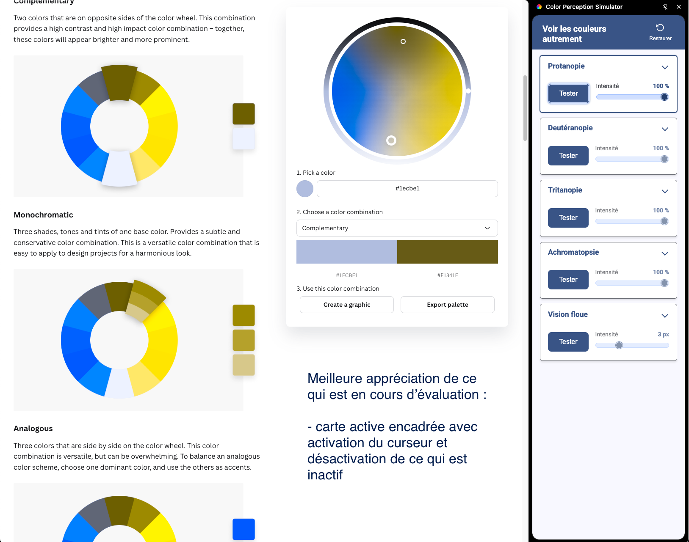
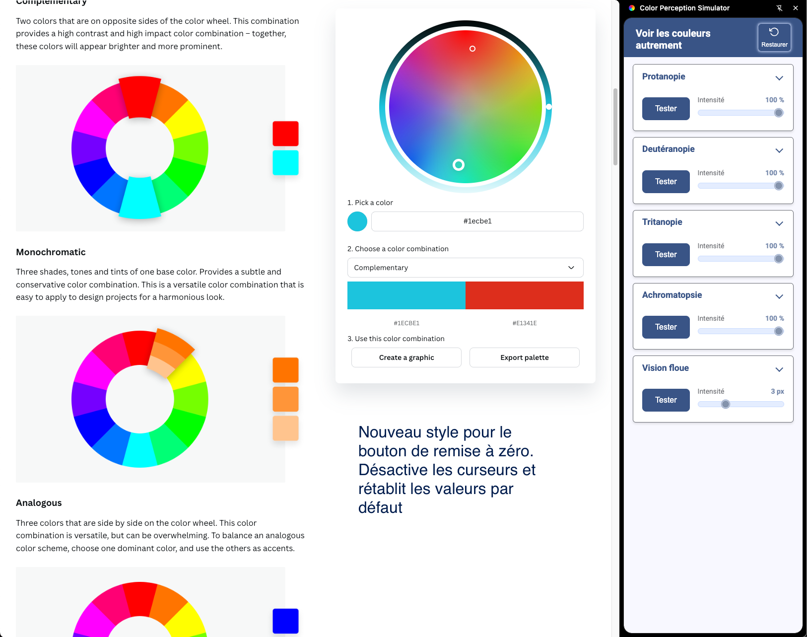

# CHANGELOG

## 31/10/2025

1. **Corrections CSS et optimisations** :

	- Suppression des styles en double dans `side_panel.css`

	- Correction des marges du conteneur principal pour éliminer les problèmes de scroll

	- Ajout de `scrollbar-gutter: stable both-edges` pour éviter les sauts de contenu

	- Amélioration de la transition de la classe `.card.active` pour un feedback visuel
	  instantané 

	- Harmonisation de l'indentation (tabs au lieu d'espaces) pour une meilleure cohérence du code

1. **Amélioration terminologique** : Remplacement du terme "Simuler" par "Tester" dans toutes les locales (

fr/en/de/es/it/nl) pour une approche plus empathique et moins stigmatisante. Ce changement reflète mieux l'objectif
de sensibilisation et de compréhension des troubles de perception des couleurs.

1. **Refonte complète de l'affichage des curseurs d'intensité** :

	- Stylisation CSS avancée des inputs `range` avec suppression de l'apparence par défaut (`-webkit-appearance: none`)

	- Personnalisation du thumb (poignée) avec bordures, outline et couleurs Material Design

	- Ajout d'un affichage en temps réel de la valeur du curseur (en % pour les troubles de perception, en px pour le
	  flou)

	- Implémentation d'un span `.range--span` dynamiquement mis à jour via JavaScript dans la fonction
	  `updateRangeValue()`

	- Amélioration du layout avec `inline-flex` et gestion responsive des labels

	- **Gestion de l'état d'accessibilité** : Implémentation de la fonction `toggleActiveRangeInput(filter, disabled)`
	  pour activer/désactiver les curseurs selon l'état du filtre. Les curseurs sont désactivés par défaut et s'activent
	  uniquement lorsqu'un filtre est appliqué, avec un style visuel distinct (curseur `not-allowed`, opacité réduite à
	  0.5, thumb grisé) pour indiquer clairement l'état inactif. Cela améliore l'expérience utilisateur en évitant la
	  confusion et respecte les standards d'accessibilité WCAG.

1. **Refactorisation majeure du panneau latéral (side panel)** :

	- **Structure HTML** : Ajout d'IDs sémantiques pour tous les éléments (headings, descriptions) pour améliorer
	  l'accessibilité ARIA

	- **CSS** : Migration des propriétés CSS personnalisées (variables CSS) pour une meilleure maintenabilité, avec
	  ajout de variables dynamiques `--_border-color-card`, `--_border-width-card`, `--_border-style-card`

	- **État actif** : Implémentation d'une classe `.active` avec feedback visuel (bordure colorée et box-shadow) pour
	  indiquer quelle carte est actuellement utilisée

	- **Amélioration du layout** : Passage à `grid-auto-flow: row` pour un meilleur contrôle du flux, ajustement des
	  marges et padding pour éviter les problèmes de scroll

	- **Bouton reset** : Refonte du style avec ajout d'une icone SVG dans le bouton, clarification du sens, amélioration
	  des
	  états `:hover`, `:focus`, `:active` 

	- **JavaScript** : Fonction `toggleActiveSections()` pour gérer l'état actif des cartes, amélioration de la fonction
	  `updateRangeValue()` pour afficher les valeurs avec unités

1. **Mise à jour du titre de l'extension** : Modification dans `_locales/en/messages.json` et

`_locales/fr/messages.json` vers "See Colors Differently" / "Voir les couleurs autrement" pour un message plus
inclusif et positif.

1. **Support multilingue étendu** : Ajout de 4 nouvelles langues à l'extension : allemand (de), espagnol (es),
   italien (

it) et néerlandais (nl). Création des fichiers `_locales/[langue]/messages.json` avec traduction complète de tous les
messages de l'interface (titres des troubles, descriptions, boutons, notifications). L'extension est maintenant
disponible en 6 langues au total.

### **Détails techniques**

Variables CSS utilisées pour la personnalisation : `--_border-color-card`, `--_border-width-card`,

`--_border-style-card`, `--box-shadow-card`
Nouveaux attributs ARIA ajoutés : `aria-labelledby`, `aria-describedby` sur tous les boutons et inputs range
Gestion d'état via classe CSS `.active` avec toggle dans JavaScript
Fonctions JS améliorées : `updateRangeValue()`, `toggleActiveSections()`, `onClickSimulateButton()`

## 23/08/2025

1. **Fix bug clic sur l'icone d'action de l'extension** : Le panneau latéral s'ouvre correctement à chaque clic sur l'

icône de l'extension.

1. **Fix espacement du titre h2 des cards** : Correction de l'espacement du titre h2 dans les cartes pour une
   meilleure
   lisibilité.
1. **Fix css alert box** : Amélioration du style de la boîte d'alerte pour une meilleure visibilité et lisibilité.
1. **Amélioration des URLs bloquées** : La fonction de détection des URLs bloquées a été améliorée pour inclure les
   URLs
   du Chrome Web Store et de Chrome Developer Documentations. Chrome bloque de lui-meme les extensions sur ses
   differents domaines pour des raisons de sécurité.

## 17/08/2025

1. **Menu contextuel** : Accès rapide à l'extension via menu contextuel (clic

droit) 

1. **Interface en panneau latéral** : Remplacement du popup par un side
   panel 
1. **Curseurs d'intensité** : Pour chaque trouble, un curseur permet d'ajuster l'intensité et de se rendre compte des
   niveaux intermédiaires de troubles
1. **Vision floue (blur effect)** : Simulation de l'effet de flou
   visuel 
1. **Support i18n** : L'extension est désormais localisée en français et en anglais, avec la possibilité d'ajouter d'
   autres langues facilement.

L'extension utilise désormais l'API Side Panel de Chrome pour une meilleure intégration et le menu contextuel permet un
accès direct aux filtres.

:warning: **Note** : L'extension ne fonctionne pas sur les services **chrome** tels que ceux commencant par `chrome://`
ou `chrome-extension://`. Chrome bloque ceci par sécurité. Il est recommandé de l'utiliser sur des sites web normaux
pour une expérience optimale.

ℹ️ À propos de l’avertissement « Extension non approuvée »
Lors de l’installation, Chrome peut afficher le message :
« Extension non approuvée par la navigation sécurisée avec protection renforcée »
👉 Ce message ne signifie pas que l’extension est dangereuse.

Il s’agit d’un mécanisme de sécurité supplémentaire de Chrome (Enhanced Safe Browsing), qui peut afficher cet
avertissement même pour des extensions publiées et validées sur le Chrome Web Store.
Ce message est temporaire : il disparaît automatiquement après une période d’utilisation, lorsque Chrome reconnaît
l’extension comme « de confiance ».
Vous pouvez poursuivre l’installation en toute sécurité.

L’extension a été vérifiée et approuvée par Google lors de sa publication.

**Vous pouvez inspecter le code source distribué ici pour être sûr de son contenu : c'est exactement ces sources qui
sont deployées sur le store.
Cette extension a une visée éducative et humaniste. Je m'engage à ce qu'elle ne soit jamais intrusive, ni malveillante.
**