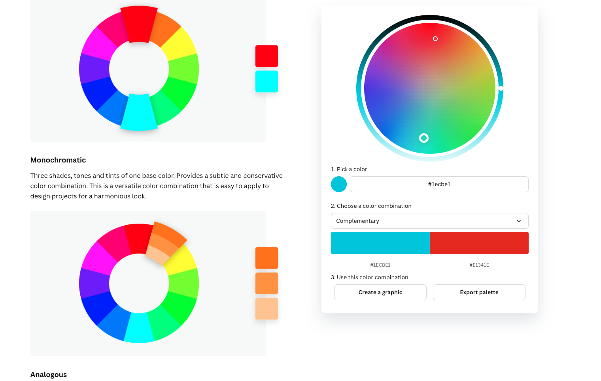
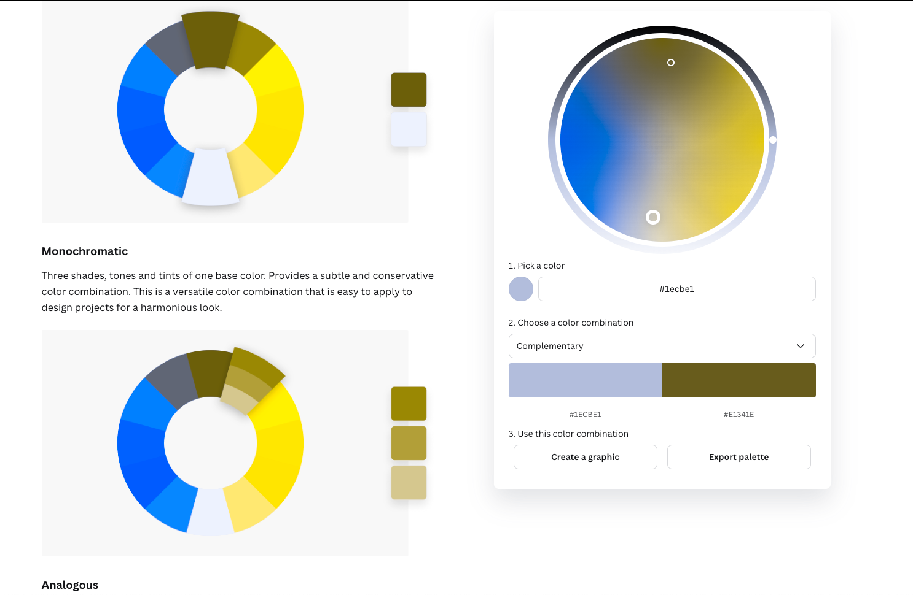
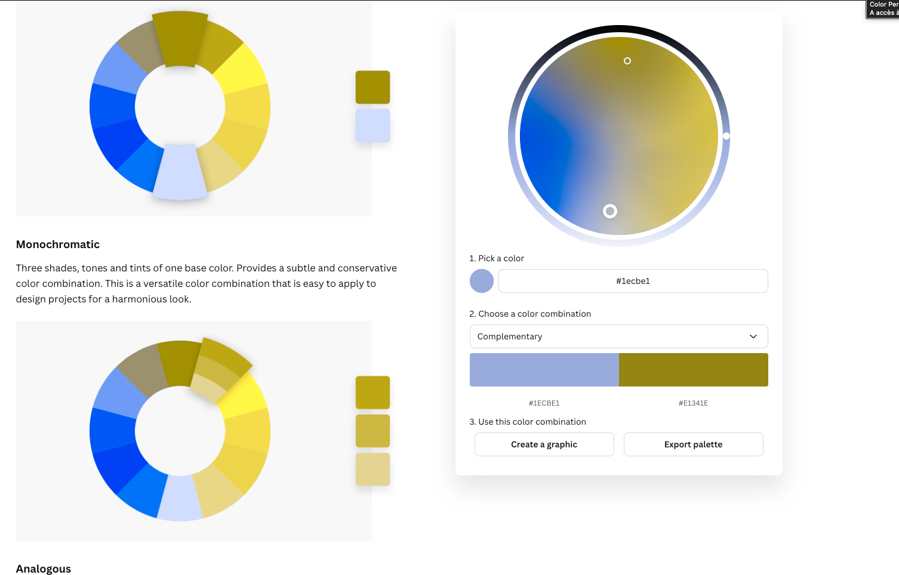
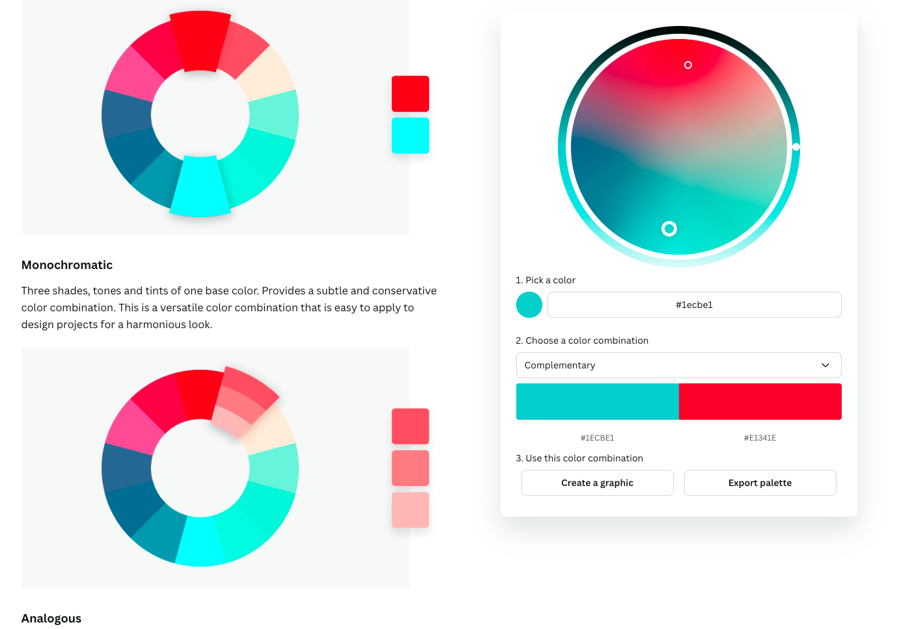
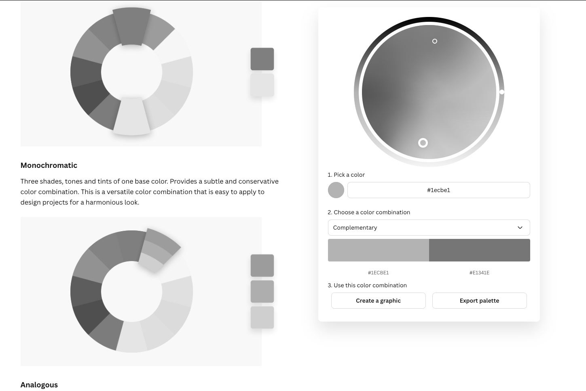
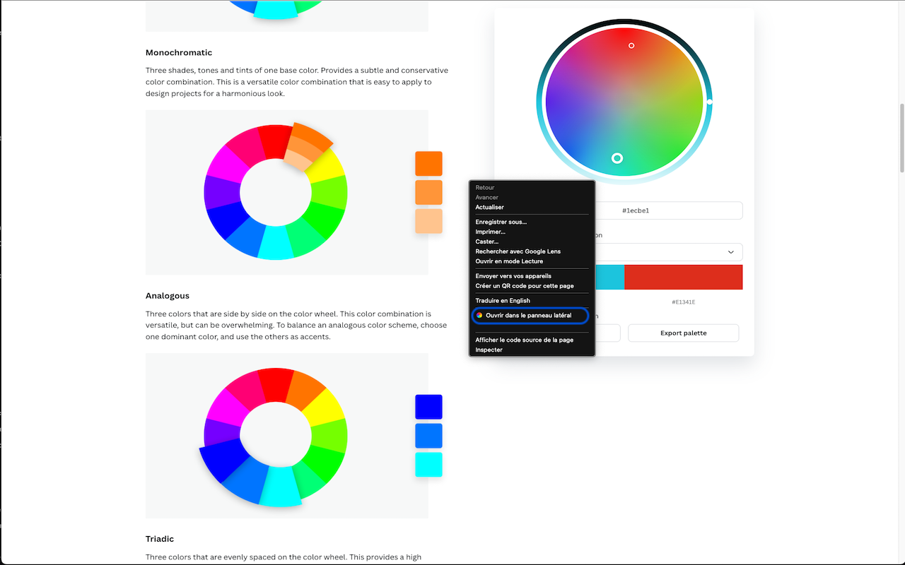
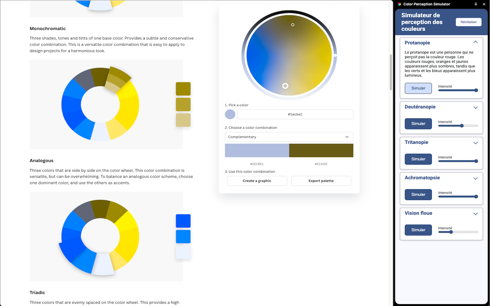
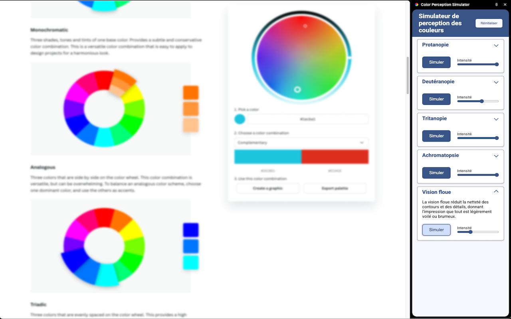

# Color Perception Simulator

Cette extension permet de donner un aperçu approximatif des effets qu'induisent un trouble de la perception des couleurs. Une personne sur 20 souffre d'un de ces troubles.

## Types de trouble de la perception des couleurs

Le visuel est tiré de la [Roue des Couleurs](https://www.canva.com/colors/color-wheel/) du site [Canva](https://www.canva.com/)

Il existe quatre types principaux de trouble de la perception des couleurs :

1. **Protanopie** : Les personnes atteintes de protanopie ont des difficultés à percevoir les teintes rouges. Cela peut rendre les rouges, oranges et certains verts difficiles à distinguer.
   

2. **Deutéranopie** : Les personnes atteintes de deutéranopie ont des difficultés à percevoir les teintes vertes. Cela peut rendre les verts, jaunes et certains rouges difficiles à distinguer.
   

3. **Tritanopie** : Les personnes atteintes de tritanopie ont des difficultés à percevoir les teintes bleues. Cela peut rendre les bleus et certains jaunes difficiles à distinguer.
   

4. **Achromatopsie** : Les personnes atteintes d'achromatopsie ne perçoivent aucune couleur et voient le monde en nuances de gris. Ce trouble est rare et est souvent associé à une sensibilité à la lumière et une faible acuité visuelle.
   

## Création d'une Extension Chrome

Pour créer une extension Chrome, suivez ces étapes :

1. Créez un dossier pour votre projet.
2. Ajoutez un fichier `manifest.json` pour décrire votre extension.
3. Ajoutez les fichiers HTML, CSS et JavaScript nécessaires pour votre extension.
4. Testez votre extension localement en la chargeant dans Chrome via `chrome://extensions/` en mode développeur.

## Utilisation de l'Extension Localement

### Pour utiliser l'extension localement

1. Placez tous les fichiers dans un dossier.
2. Ouvrez Chrome et allez à `chrome://extensions/`.
3. Activez le mode développeur.
4. Cliquez sur "Charger l'extension décompressée" et sélectionnez le dossier contenant vos fichiers.
5. Cliquez sur l'icône de l'extension pour appliquer les filtres.

<https://github.com/user-attachments/assets/441526a1-8e1e-49af-8fdc-c2b7f1967f71>

### Publication sur le store

1. Créer un compte développeur sur le store Chrome, payer les 5 euros de frais d'inscription.
2. S'assurer que les fichiers suivants sont présents dans le dossier de l'extension (et correctement configurés) :

- `manifest.json`,
- `background.js`,
- `128.png`,

3. Compresser le dossier de l'extension en un fichier ZIP.
4. Aller sur le [Chrome Web Store Developer Dashboard](https://chrome.google.com/webstore/devconsole) et cliquer sur "Add a new item".

## Documentation

### Génération du thème CSS Material-like

23/02/2025: Reprise du thème pour une approche plus accessible de l'extension, application du thème light, contraste standard

- [Material Theme Builder](https://material-foundation.github.io/material-theme-builder/)

### Canva

- [Roue des Couleurs](https://www.canva.com/colors/color-wheel/)

### Matrice de transformations

- [Chrome Developer](https://developer.chrome.com/docs/chromium/cvd?hl=fr)
- [A Physiologically-based Model for Simulation of Color Vision Deficiency](https://www.inf.ufrgs.br/%7Eoliveira/pubs_files/CVD_Simulation/CVD_Simulation.html)
- [MDN <feColorMatrix>](https://developer.mozilla.org/en-US/docs/Web/SVG/Element/feColorMatrix)
- [Convert to GrayScale](https://developer.apple.com/documentation/Accelerate/converting-color-images-to-grayscale?utm_source=chatgpt.com)

### API Chrome

- [Chrome Developper Extension API](https://developer.chrome.com/docs/extensions/reference/api?hl=fr)
- [Exemples d'extension](https://github.com/GoogleChrome/chrome-extensions-samples)

### License

- [Custom License](./LICENSE.txt)## Nouveaux ajouts

## Nouveaux ajouts

- 23/08/2025 :

1. **Fix bug clic sur l'icone d'action de l'extension** : Le panneau latéral s'ouvre correctement à chaque clic sur l'icône de l'extension.
1. **Fix espacement du titre h2 des cards** : Correction de l'espacement du titre h2 dans les cartes pour une meilleure lisibilité.
1. **Fix css alert box** : Amélioration du style de la boîte d'alerte pour une meilleure visibilité et lisibilité.
1. **Amélioration des URLs bloquées** : La fonction de détection des URLs bloquées a été améliorée pour inclure les URLs du Chrome Web Store et de Chrome Developer Documentations. Chrome bloque de lui-meme les extensions sur ses differents domaines pour des raisons de sécurité.

- 17/08/2025 :

1. **Menu contextuel** : Accès rapide à l'extension via menu contextuel (clic droit) 
1. **Interface en panneau latéral** : Remplacement du popup par un side panel 
1. **Curseurs d'intensité** : Pour chaque trouble, un curseur permet d'ajuster l'intensité et de se rendre compte des niveaux intermédiaires de troubles
1. **Vision floue (blur effect)** : Simulation de l'effet de flou visuel 
1. **Support i18n** : L'extension est désormais localisée en français et en anglais, avec la possibilité d'ajouter d'autres langues facilement.

L'extension utilise désormais l'API Side Panel de Chrome pour une meilleure intégration et le menu contextuel permet un accès direct aux filtres.

:warning: **Note** : L'extension ne fonctionne pas sur les services **chrome** tels que ceux commencant par `chrome://` ou `chrome-extension://`. Chrome bloque ceci par sécurité. Il est recommandé de l'utiliser sur des sites web normaux pour une expérience optimale.

ℹ️ À propos de l’avertissement « Extension non approuvée »
Lors de l’installation, Chrome peut afficher le message :
« Extension non approuvée par la navigation sécurisée avec protection renforcée »
👉 Ce message ne signifie pas que l’extension est dangereuse.
Il s’agit d’un mécanisme de sécurité supplémentaire de Chrome (Enhanced Safe Browsing), qui peut afficher cet avertissement même pour des extensions publiées et validées sur le Chrome Web Store.
Ce message est temporaire : il disparaît automatiquement après une période d’utilisation, lorsque Chrome reconnaît l’extension comme « de confiance ».
Vous pouvez poursuivre l’installation en toute sécurité.

L’extension a été vérifiée et approuvée par Google lors de sa publication.

**Vous pouvez inspecter le code source distribué ici pour être sûr de son contenu : c'est exactement ces sources qui sont deployées sur le store.
Cette extension a une visée éducative et humaniste. Je m'engage à ce qu'elle ne soit jamais intrusive, ni malveillante.**
