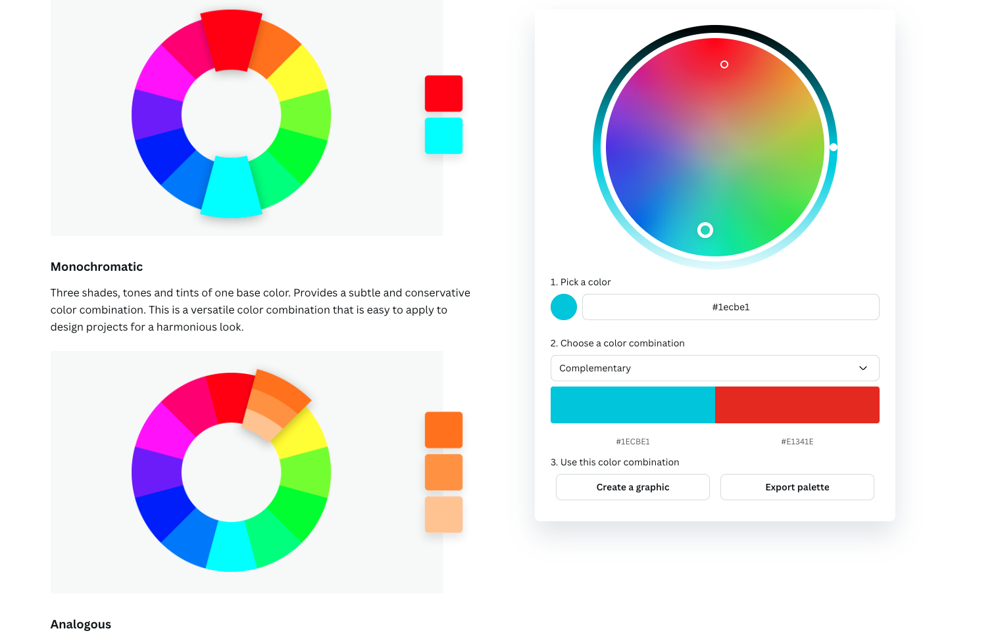

# Color Perception Simulator

Cette extension permet de donner un aperçu approximatif des effets qu'induisent un trouble de la perception des couleurs. Une personne sur 20 souffre d'un de ces troubles.

## Types de trouble de la perception des couleurs

Le visuel est tiré de la [Roue des Couleurs](https://www.canva.com/colors/color-wheel/) du site [Canva](https://www.canva.com/)

Il existe quatre types principaux de trouble de la perception des couleurs :

1. **Protanopie** : Les personnes atteintes de protanopie ont des difficultés à percevoir les teintes rouges. Cela peut rendre les rouges, oranges et certains verts difficiles à distinguer.
   

2. **Deutéranopie** : Les personnes atteintes de deutéranopie ont des difficultés à percevoir les teintes vertes. Cela peut rendre les verts, jaunes et certains rouges difficiles à distinguer.
   

3. **Tritanopie** : Les personnes atteintes de tritanopie ont des difficultés à percevoir les teintes bleues. Cela peut rendre les bleus et certains jaunes difficiles à distinguer.
   

4. **Achromatopsie** : Les personnes atteintes d'achromatopsie ne perçoivent aucune couleur et voient le monde en nuances de gris. Ce trouble est rare et est souvent associé à une sensibilité à la lumière et une faible acuité visuelle.
   

## Création d'une Extension Chrome

Pour créer une extension Chrome, suivez ces étapes :

1. Créez un dossier pour votre projet.
2. Ajoutez un fichier `manifest.json` pour décrire votre extension.
3. Ajoutez les fichiers HTML, CSS et JavaScript nécessaires pour votre extension.
4. Testez votre extension localement en la chargeant dans Chrome via `chrome://extensions/` en mode développeur.

## Utilisation de l'Extension Localement

Pour utiliser l'extension localement :

1. Placez tous les fichiers dans un dossier.
2. Ouvrez Chrome et allez à `chrome://extensions/`.
3. Activez le mode développeur.
4. Cliquez sur "Charger l'extension décompressée" et sélectionnez le dossier contenant vos fichiers.
5. Cliquez sur l'icône de l'extension pour appliquer les filtres.

https://github.com/user-attachments/assets/441526a1-8e1e-49af-8fdc-c2b7f1967f71

## Documentation

### Génération du thème CSS Material-like

23/02/2025: Reprise du thème pour une approche plus accessible de l'extension, application du thème light, contraste standard

- [Material Theme Builder](https://material-foundation.github.io/material-theme-builder/)

### Canva

- [Roue des Couleurs](https://www.canva.com/colors/color-wheel/)

### Matrice de transformations:

- [Chrome Developper](https://developer.chrome.com/docs/chromium/cvd?hl=fr)
- [A Physiologically-based Model for Simulation of Color Vision Deficiency](https://www.inf.ufrgs.br/%7Eoliveira/pubs_files/CVD_Simulation/CVD_Simulation.html)
- [MDN <feColorMatrix>](https://developer.mozilla.org/en-US/docs/Web/SVG/Element/feColorMatrix)

### API Chrome

- [Chrome Developper Extension API](https://developer.chrome.com/docs/extensions/reference/api?hl=fr)
- [Exemples d'extension](https://github.com/GoogleChrome/chrome-extensions-samples)
